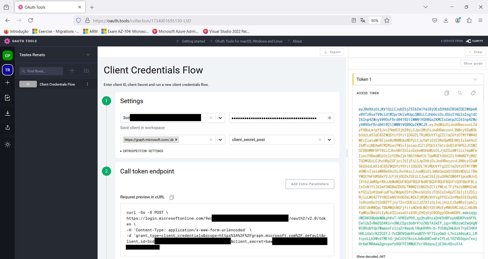
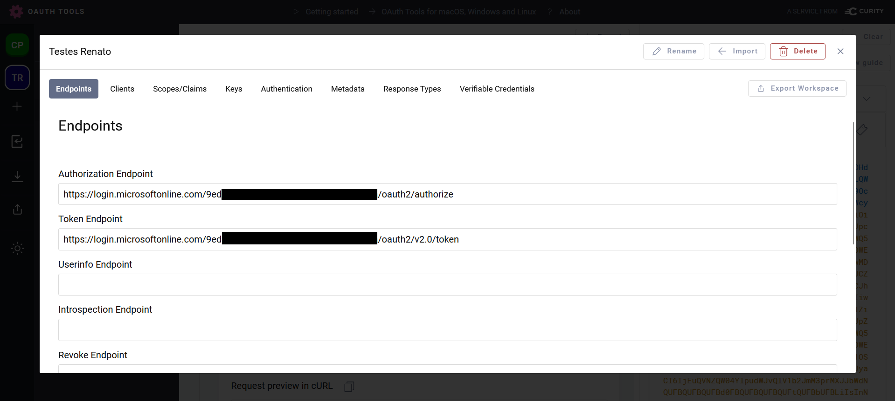
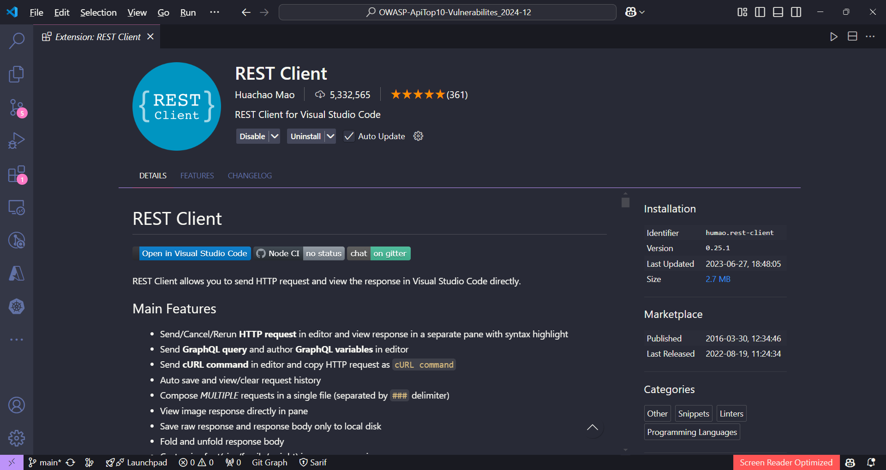

# OWASP-ApiTop10-Vulnerabilites_2024-12
Materiais de apresentação sobre OWASP API Security Top 10 realizada no dia 11/12/2024. Inclui ainda informações sobre iniciativas da OWASP para Docker/containers e Inteligência Artificial.

---

## Certificações Gratuitas da APIsec University

Site da APIsec University: **https://www.apisecuniversity.com/**

Artigos que produzi sobre alguns desses treinamentos/certificações:

[**Certificação Gratuita: OWASP API Security Top 10**](https://renatogroffe.medium.com/certifica%C3%A7%C3%A3o-gratuita-owasp-api-security-top-10-49187dadd141)

[**Certificação Gratuita: API Security Fundamentals**](https://renatogroffe.medium.com/certifica%C3%A7%C3%A3o-gratuita-api-security-fundamentals-40ff8a8f2eb0)

[**Certificação Gratuita: API Gateway Security Best Practices**](https://renatogroffe.medium.com/certifica%C3%A7%C3%A3o-gratuita-api-gateway-security-best-practices-feb18932d4a5)

[**Certificação Gratuita em Inteligência Artificial: Securing LLM & NLP APIs**](https://renatogroffe.medium.com/certifica%C3%A7%C3%A3o-gratuita-em-intelig%C3%AAncia-artificial-securing-llm-nlp-apis-bd8446c38a70)

## OAuth Tools

Ferramenta online para testes com diversos fluxos de autenticação padronizados.

Link: **https://oauth.tools/**

Exemplo de fluxo utilizando autenticação com **Client Credentials** no **Microsoft Entra ID**:

Necessário antes disso configurar também um workspace, com os endpoints empregados num fluxo de autenticação:

---

## Extensão REST Client no Visual Studio Code

Exemplo de teste utilizando a extensão **REST Client** e o comando curl gerado com o **OAuth Tools**:

O script pode ser encontrado na pasta **/tests**.

Saiba mais sobre a extensão **REST Client** em: **https://marketplace.visualstudio.com/items?itemName=humao.rest-client**

